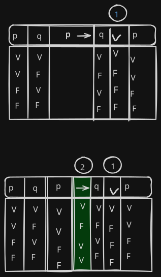

# Propositional Logic Pedagogy Mentor

## Problem: 

In different education levels and areas, the topic of propositional logic is taught as part of the curricula; therefore, there is a clear need for students to understand this subject. Usually, the related topics and sub-topics (e.g., truth tables) are taught directly by the teacher using a physical or virtual board, and some exercises are assigned to the students to practice. 

This process can be repetitive and ambiguous. Most of the time, the teacher needs to check the student's process step-by-step while solving an exam to diagnose possible flaws in their reasoning. Alternatively, this diagnostic step is plainly omitted and replaced by a multiple-choice test, where the teacher needs to create the questions and their respective answers, just to mention some of the bottlenecks of the process. 

We consider these as bottlenecks because propositional logic is a topic that is not open for interpretation, but since the results are deterministic and the processes behave more like an algorithm than a creative endeavor, the entire domain is latently automatable. 

Let's examine a specific sub-topic and how it is traditionally taught. 

### Truth tables

We will not explain here what they are. But the way this topic is traditionally taught forces the student to go through a sequence like this: 

1. Memorize the precedence of the operators.
2. Memorize the truth tables of atomic expressions.
3. Recognize these atomic elements within a molecular expression.
4. Separate the molecular expression into smaller groups.
5. Decide which parts will be computed first according to their precedence.
6. Compute the values using the memorized truth tables.

This is done one atomic expression at a time. For instance:

```
p -> q v p
```

Is solved as:



There are other variations of this method, like omitting to copy the values of the variables again because, understandably, doing so manually is cumbersome for a human. Other teachers add different colors to differentiate the steps better and use legends. Also, the final table is the only thing the student visualizes at the end. The intermediate tables disappear, meaning there is no way to go back in time, unless the class was recorded or if this entire process is documented step-by-step in a book. 

## Opportunities

This situation creates an opportunity to automate the computation and enhance the teaching process. For example, we could build a debugger-like tool that explains the logic step-by-step, or generate automated examples and exercises that validate a student's process at every single step. The goal is to give students a richer experience while learning logic, and to give teachers powerful tools to enhance that learning experience. 

## Out of scope opportunities to keep in mind

This is a bit of a stretch, but what we learn from the tools we create—and how students and teachers use them—can be used to build more tools for teaching mathematics in other fields. Because other mathematical topics also share this deterministic nature, some components we build are going to be completely reusable. 

For instance, let's say we create a specialized keyboard, since math has its own set of symbols and representations. If we need another specialized keyboard down the line, we can abstract what we learned from this first experience to build a meta-tool that generates specialized keyboards for any mathematical operations. Another example is the step-by-step tracking engine; managing state transformations over a timeline is a transversal responsibility across many different mathematical topics. 

Also, it is currently out of reach because of the effort and investigation needed to create engines that teach creative solutions using clever tricks. Regardless, while shortcuts are usually born from human creativity and not raw computation, some parts of the process of investigating these clever tricks can be automated. This would aid users in finding new ways and paths to solve exercises outside the realms of classical algorithms, which is highly useful to prepare for contests and tests that value only getting the answer in the shortest possible time.

## TODO
- Explore opportunities and problems about accesibility
