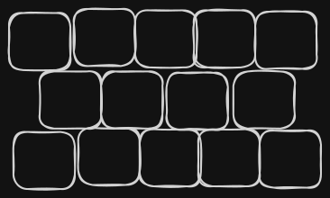
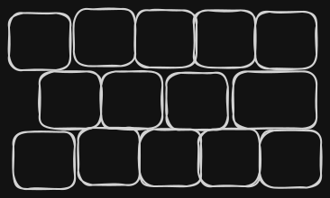
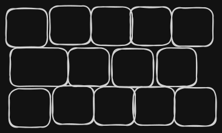

# Discovery of implemeting the brick wall layout

A virutal Keyboard is essentially buttons, of course you can use other kind of HTML custom elemtns derived from a HTML button but still for this POC, a button will do.

Let's start with a fixed set of buttons and then move up in the process of abstraction to define what could be set as variables. Let's imagine we need 5 keys in the first row of keys, and the second therefore must have 4 keys and the following row must contain 5 again. 

Or alternative, it can be shown as the last key of the row that contains for to ocupy as much as two keys

Or maybe the first key also

So, I reason that is not actaully that the second row had only space for 4 exact same width keys, but actually it was able to occupy whatever horizatal space is available. This makes me thin that this layout actaully can be thught as having "invisible" cells that are pretty much straigth as in a traditional table

