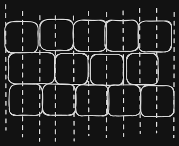
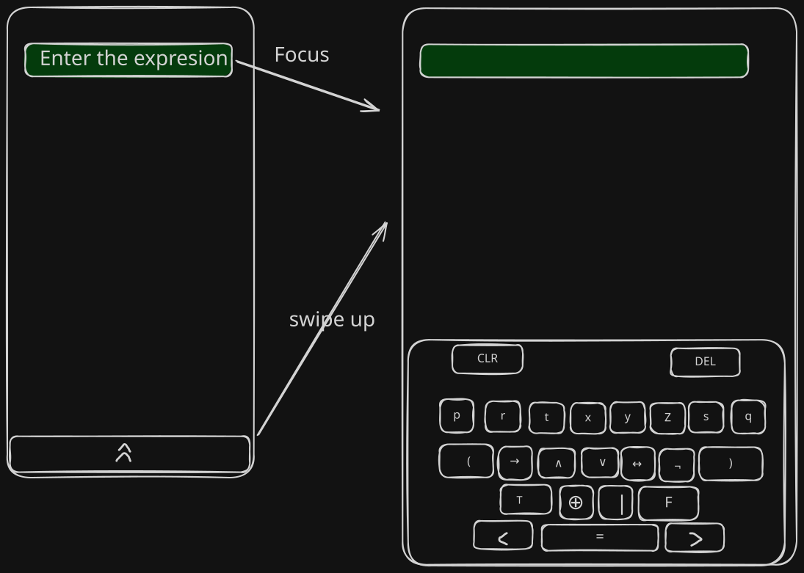

# Discovery of implemeting the brick wall layout

A virutal Keyboard is essentially buttons, of course you can use other kind of HTML custom elemtns derived from a HTML button but still for this POC, a button will do.

Let's start with a fixed set of buttons and then move up in the process of abstraction to define what could be set as variables. Let's imagine we need 5 keys in the first row of keys, and the second therefore must have 4 keys and the following row must contain 5 again. 


Or alternative, it can be shown as the last key of the row that contains for to ocupy as much as two keys


Or maybe the first key also


So, I reason that is not actaully that the second row had only space for 4 exact same width keys, but actually it was able to occupy whatever horizatal space is available. This makes me thin that this layout actaully can be thught as having "invisible" cells that are pretty much straigth as in a traditional table




The total number of "invisible" columns is 10, and it is not a coindicence, because is the double of 5, this makes sense since each key woudl occupy two columns and to create the brick wall effect, we woudl need to skip on colum at the start or as u can see be as large as possible to occpy nthe next invisible column.

So, we can say that each key can ocupy 2 or more inviisble columns, if we want to make a key to be single colum, it occupies 2 invisible columns, if we need the key to occpy 2 columns, this means 3 invisible columns , and so on, we conclude if a key cisaully needes to have n columns, it woudl occupy n+1 columns.

To create this effect we can use a grid layout in css, to simplify the study we woul use a 3 as maximum of columns 

```html
<style>
  button{
    grid-span: 2;
  }
    
</style>
<div 
    style="
        display: grid; 
        grid-template-columns: repeat(1fr, 10);
    "
>
    <button>A</button>
    <button>A</button>
    <button>A</button>
    <button >B</button>
    <button>B</button>
</div>
```

The problem here is that the second row is not aware that needs to start from the scond column. We can solve that by singaling the second column with a class

```html
<style>
  button{
    grid-column:span 2;
  }

    .second-row-start{
      grid-column: 2 / span 2;
    }
    
</style>
<div 
    style="
        display: grid; 
        grid-template-columns: repeat(6, 1fr);
    "
>
    <button>A</button>
    <button>A</button>
    <button>A</button>
    <button class="second-row-start">B</button>
    <button>B</button>
</div>
```



Now it works, nevertheless; we can consider the number of  max columns as a parameter (and the grid columns woul dbe the double), if so, maybe we can use this parameter to calculate wich of the items are the start of a new row. Also anotehr parameter for each item is how many columns it would take, the defautl would be 1 (meaning the grid columsn it woudl take be 2). Also we need to know ehre the row ends and if a row is a row that is odd in order, so also if the row is odd and the nbumebr of columns of the first key is more than 1, the row starts in the first grid column and not the second.

Doing this idea with pure css aand grid would provided impossible, so the calculations need to be done before the html is placed, or added manually, or added via jsavascript  DOM manipulation and reading.

So another way would be using flexbox and each row being on itws own container, in this way we can use nt-child css to do the trick. This adds and extra container and thuis an HTML element for each row.

## The logical and boolean operations calculator
As we stated in the other article, the motivation for this
is to create a virtual keyboard for a logical and booelan operations
input calculator. Because the operations for this particualr area of maths and logic are fixed, the keyboard in a initial release that would make usueful to students wont change indematly. It is true that we may want to add supprot for more than the 5 operatiosn show in the mockup, and also offer options of personalzaition of the layout liek adding and optioing out some operations or creating custom virtual keys for repetitive operations, we are goign to make grow the app incrmentally, so we can start doing ths mockup as an excersi drietcly with grid.

Now, I was thinking also that we can have some sort of way to sue grid template for this kind of layouts, since each key has a unique symbol we can identify the lanes by those symbols by default as the grid areas.

## Information emission
Traditionally, text editors evaluate plain text, first there is some sort of prcess that tokenizes (creates chunks of choipped text called tokens according to some rules) and then a Lexer assings to each token a cateagory like for isntiance NUMBER or OPERATOR. BUt since we ha avirutal synthetic keyaboard, we have control oever what symbols can be emitted, and thus we can actually map to each button to emit directly a token with its syntatical meaning and avoid
the step of a lexer tryign to analyze raw text. 

But visually we do not need this tokens per se, visually we need text, the good nows is that this text can be dereived from the the token stream that the buttons  can emmit to some centralized storage in the client. 

## Syntax hihgligthing
Beacuse inputs cannot actually admit sintax hgiglthing , we need to have instead of aHTML input a contenedtible box like a div. We can use css to apply sintax hightlhing. Is improtat to remind you that the buttons are goign to emit tokens and save them in some sort of toekn stream, this token stream can pass to some sort of valdiator, like a LSP alike service that will emmit events upon erros and new stream tokens so we can have anotehr service to react to these events to create Ranges for sintax hightlthing. 

We are going to start doing an impleemntion on react (CSR only) of this precise example.
